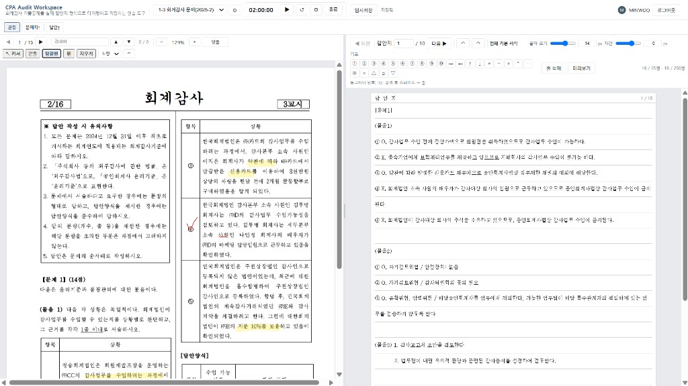
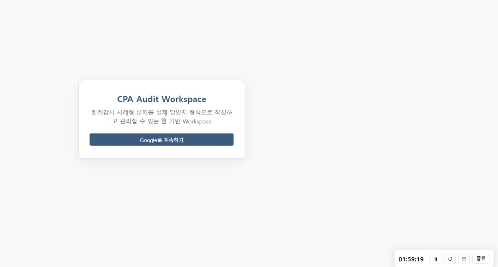
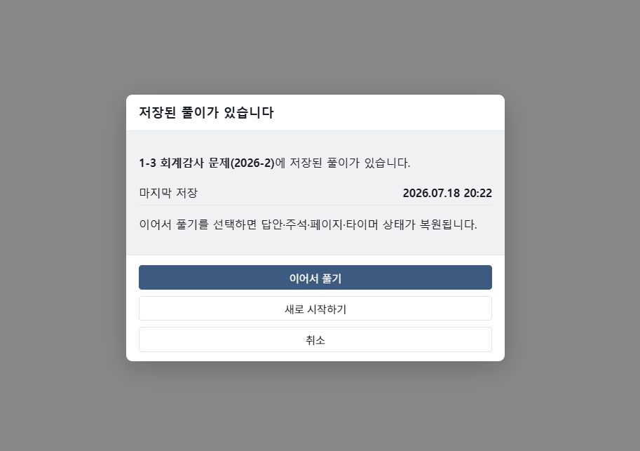
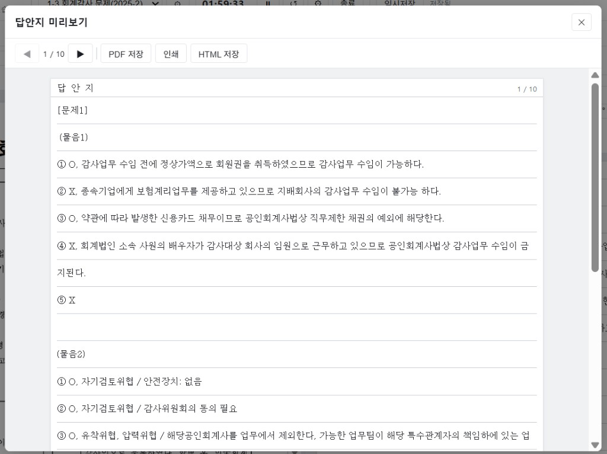

# CPA Audit Workspace

> CPA 회계감사 기출문제를 실제 시험처럼 연습하고,  
> 풀이 기록을 저장·관리할 수 있는 웹 기반 학습 워크스페이스

Live Demo: https://cpa-audit-workspace.onrender.com  
GitHub Repository: https://github.com/minwookim5433/cpa-audit-workspace

Google 로그인 후 사용할 수 있는 서비스입니다.

CPA 회계감사 기출문제를 반복해서 연습하는 과정에서 손으로 답안을 작성해야 하는 부담과 문제지·답안지를 따로 관리해야 하는 불편, 이전 풀이를 다시 찾아보기 어려운 점을 개선하기 위해 시작한 프로젝트입니다. 실제 시험처럼 타이핑하고, 문제지와 답안지를 동시에 보며, 임시저장·이어풀기·PDF 출력까지 하나의 흐름으로 연결했습니다.



문제지와 답안지를 한 화면에서 보며 실제 시험 환경처럼 답안을 작성할 수 있습니다. 형광펜·밑줄·펜 주석, 타이머, 임시저장과 함께 글자 크기와 자간을 조절해 자신의 작성 방식에 맞게 답안을 작성할 수 있습니다.

---

## 한눈에 보는 프로젝트

| 단계 | 내용 |
|---|---|
| Problem | 손으로 직접 답안 작성 시 부담, 문제지·답안지 분리 보관, 이전 풀이 재확인의 어려움 |
| Idea | 시험지를 펼친 채 답안지 형식으로 타이핑하고, 풀이 기록을 저장·재학습할 수 있는 워크스페이스 |
| Development | PDF 열람·주석·답안 작성, Google 로그인, 사용자별 임시저장·이어풀기, 대용량 PDF 대응 |
| Result | [배포 서비스](https://cpa-audit-workspace.onrender.com)에서 문제 풀이, 기록 관리, 이어풀기, 답안 PDF 출력까지 하나의 흐름으로 구현 |

---

## 프로젝트 소개

기출문제 답안을 매번 손으로 쓰는 방식은 실제 시험 감각에는 도움이 되지만, 반복 연습할수록 시간과 체력 부담이 커집니다. PDF, 답안, 주석, 진행 상태가 흩어져 있으면 이전 풀이를 이어가기도 어렵습니다.

이를 위해 시험지와 답안지를 나란히 두고, 실제 시험 답안지와 유사한 형식으로 타이핑하며 연습할 수 있도록 만들었습니다. 학습 중 임시저장으로 중단하고, 다시 접속해 이어풀기할 수 있으며, 시험 종료 후 PDF로 답안을 남길 수 있습니다.

답안·주석·진행 상태는 사용자 계정(Supabase)에 저장되고, PDF 원본은 기기 로컬(IndexedDB)에만 둡니다. 다른 기기이거나 PDF 원본이 남아 있지 않으면, 동일한 PDF 파일을 다시 선택해야 할 수 있습니다.

초기에는 AI 답안 첨삭을 검토했으나, 검증되지 않은 채점보다 기록 관리 문제를 먼저 해결하는 편이 실용적이라 Workspace 중심으로 전환했습니다.

---

## 주요 기능

| 구분 | 기능 설명 |
|---|---|
| PDF 문제지 열람 | 기출문제 및 연습용 PDF 업로드, 확대·축소, 너비 맞춤 |
| 답안 작성 | 시험 답안지 형식 타이핑, 글자 크기·자간 조절, 동그라미 번호 입력, Undo/Redo |
| 문제지 주석 | 형광펜, 밑줄, 펜, 지우개 |
| Google 로그인 | Supabase Auth + Google OAuth |
| 사용자별 저장 | RLS를 적용해 답안·주석·진행 상태를 사용자별로 분리 저장 |
| 임시저장·이어풀기 | 임시저장 후 다시 로그인하면 답안·주석·진행 상태를 복원해 이어서 학습 |
| 시험 종료 | 작성 시간, 페이지 수, 행 수, 글자 수를 확인하고 사용자가 지정한 이름으로 답안 PDF 저장 |
| PDF 검색 | 텍스트 레이어가 포함된 PDF 검색·결과 이동 |
| 시험 타이머 | 시간 설정, 시작·일시정지·초기화 |
| 다중 PDF 관리 | 여러 PDF 슬롯 등록·전환 |
| 대용량 PDF 대응 | 업로드 용량 안내·제한, 버퍼 최적화, 활성 PDF Lazy Loading |

---

## 서비스 사용 흐름

```
Google 로그인 → PDF 업로드 → 시험지 열람·주석 → 답안 작성
  → 임시저장 또는 시험 종료 → 이어풀기 또는 답안 PDF 출력
```

---

## 기술 스택

| 구분 | 기술 |
|---|---|
| Frontend | HTML, CSS, JavaScript (ES Modules) |
| PDF 처리 | PDF.js (`pdfjs-dist`), html2canvas, jsPDF |
| Authentication | Supabase Auth, Google OAuth |
| Database | Supabase PostgreSQL |
| Browser Storage | IndexedDB, localStorage |
| Backend | Node.js, Express |
| Deployment | Render |
| Version Control | Git, GitHub |
| AI Development Tools | Cursor, 생성형 AI (개발 보조) |

---

## 시스템 및 데이터 구조

```
사용자 → Google OAuth / Supabase Auth → CPA Audit Workspace
  ├─ PDF.js: 렌더링·검색·주석
  ├─ IndexedDB: PDF 원본 (기기 로컬)
  └─ Supabase: 답안 · 주석 · 진행 상태
```

| 데이터 | 저장 위치 | 비고 |
|---|---|---|
| PDF 원본 | IndexedDB (기기 로컬) | 서버·DB에 업로드하지 않음 |
| 답안·주석·진행 상태 | Supabase | `auth.uid()` + RLS |
| 세션 UI 상태 | localStorage | PDF 슬롯 메타, 화면 설정 |
| 인증 | Supabase Auth | Google OAuth |

---

## 개발 과정에서의 핵심 판단

| 판단 또는 문제 | 결정 |
|---|---|
| AI 첨삭 | 현재 기능에서 제외 → 기록 관리 우선 (향후 검토) |
| 저장 방식 | 임시저장 버튼으로 사용자가 저장 시점 통제 |
| 계정 간 데이터 | RLS로 `user_id` 행 접근 제한 |
| PDF 원본 | IndexedDB만, Supabase에는 풀이 데이터만 |
| 대용량 PDF | 30MB 경고·50MB 제한, 버퍼 최적화, 활성 PDF Lazy Loading |
| 기능 범위 | 사용 테스트 후 불필요·불안정 기능 제거 |

---

## 대용량 PDF 지원 범위

| 구분 | 정책 |
|---|---|
| 30MB 이하 | 권장 |
| 30~50MB | 경고 후 사용 가능 |
| 50MB 초과 | 업로드 제한 |
| 300페이지 초과 | 성능 안내 (차단 없음) |
| 모바일 20MB 초과 | 추가 경고 |

기기·PDF 구조에 따라 로딩·검색 속도는 달라질 수 있습니다.

---

## 보안과 사용자 데이터

- Google OAuth + Supabase Auth
- `workspaces` RLS (`auth.uid() = user_id`)
- 브라우저 publishable key만 노출
- 환경변수는 `.env`(로컬)와 Render Environment Variables(배포) 분리

---

## 프로젝트 화면

### Login



Google 계정으로 로그인해 개인별 풀이 기록을 사용합니다. Supabase Auth가 세션을 관리합니다.

### Resume Workspace



저장된 풀이가 있으면 이어서 풀기를 선택해 답안·주석·페이지·타이머 상태를 복원합니다. 다른 기기에서는 동일한 PDF를 다시 선택해야 합니다.

### Main Workspace


문제지와 답안지를 한 화면에서 보며 실제 시험 환경처럼 답안을 작성할 수 있습니다. 형광펜·밑줄·펜 주석, 타이머, 임시저장과 함께 글자 크기와 자간을 조절해 자신의 작성 방식에 맞게 답안을 작성할 수 있습니다.

### PDF Preview



시험 종료 후 답안지를 미리보기하고, 작성 시간, 페이지 수, 행 수, 글자 수를 확인한 뒤 사용자가 지정한 이름으로 PDF를 저장합니다.

---

## 로컬 실행

```bash
git clone https://github.com/minwookim5433/cpa-audit-workspace.git
cd cpa-audit-workspace
npm install
npm start
```

`http://localhost:3000` · `.env.example` 참고:

| 변수 | 필수 | 설명 |
|---|---|---|
| `SUPABASE_URL` | 예 | Supabase 프로젝트 URL |
| `SUPABASE_PUBLISHABLE_KEY` | 예 | publishable (anon) key |
| `PORT` | 아니오 | 기본 3000 |

Supabase Google OAuth Redirect URL(로컬·배포) 등록 필요.

---

## 현재 한계 · 향후 계획

현재 설계에서는 PDF 원본을 저작권과 사용자 자료 보호를 고려해 서버나 DB에 저장하지 않고, 기기 로컬(IndexedDB)에만 보관합니다. 따라서 다른 기기에서 이어풀기 시에는 동일한 PDF 파일을 다시 선택해야 합니다.

또한 현재 버전은 대용량 PDF 및 모바일 환경에서 성능 제약이 있을 수 있으며, 상용 수준의 통합 테스트와 운영 모니터링은 아직 적용하지 않았습니다.

향후 계획

- 모바일 UI 개선
- 대용량 PDF 최적화
- 학습 이력 및 통계 기능 추가
- 평가 기준이 충분히 확보될 경우 제한적인 AI 피드백 기능 검토

---

## 프로젝트 회고

- CPA 회계감사 기출문제를 반복해서 연습하는 과정에서 느낀 실제 불편을 해결하기 위해 시작했습니다.
- 진행하면서 AI의 성능 자체보다 해결해야 할 문제를 정확히 정의하는 것이 더 중요하다는 점을 배웠습니다. 사용자의 목적을 명확히 이해하고, 그 목적에 맞는 기능을 설계하는 과정이 좋은 결과로 이어진다는 것도 체감했습니다.
- Cursor와 생성형 AI는 정답을 대신 만들어 주는 존재가 아니라, 사람이 더 나은 해결책을 만들 수 있도록 돕는 개발 보조 도구로 활용했습니다.
- 기능 정의, 설계, 우선순위, 테스트, 오류 수정, 기능 삭제·방향 전환은 직접 수행했습니다.
- Google OAuth, Supabase(RLS), IndexedDB, Render 배포까지 연결해 하나의 웹 서비스로 완성했습니다.

---

## 라이선스 및 이용 안내

- 개인 학습·포트폴리오 목적 제작
- 합법적으로 이용 가능한 PDF만 업로드
- PDF 원본을 사용자 간 제공·공유하지 않음
